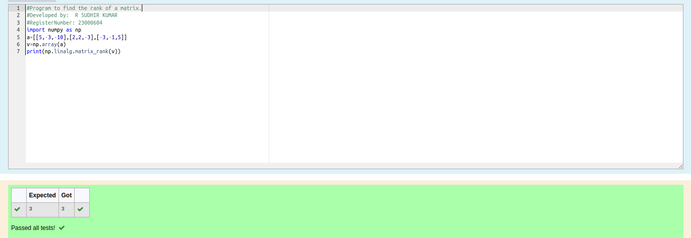

# RANK-OF-A-MATRIX
## Aim:
To write a python program to find the rank of a matrix
## Equipment’s required:
1. 	Hardware – PCs
2. 	Anaconda – Python 3.7 Installation / Moodle-Code Runner
## Algorithm:
### Step 1: 
import the module 
### Step 2:
prepare the list from each linear equation and assign as array  
### Step 3: 
Using the np.linalg.matrix_rank(), we can find the rank of the given matrix.
### Step 4:
end the program 
## Program:
```python
#Program to find the rank of a matrix.
#Developed by:  R SUDHIR KUMAR
#RegisterNumber: 23000604
import numpy as np
a=[[5,-3,-10],[2,2,-3],[-3,-1,5]]
v=np.array(a)
print(np.linalg.matrix_rank(v))
```
## Output:

## Result:
Thus the rank for the given matrix is successfully solved by  using a python program.

